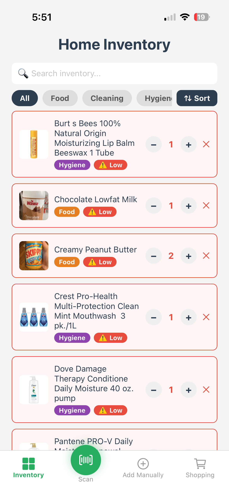
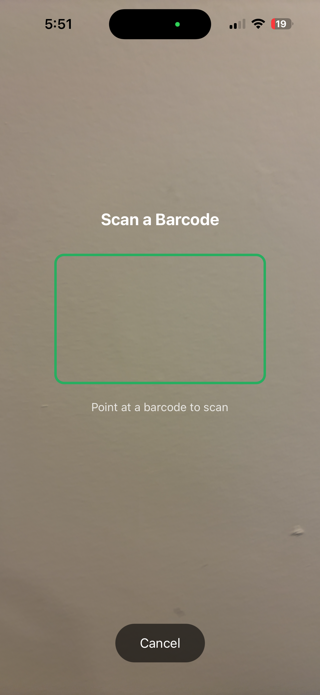
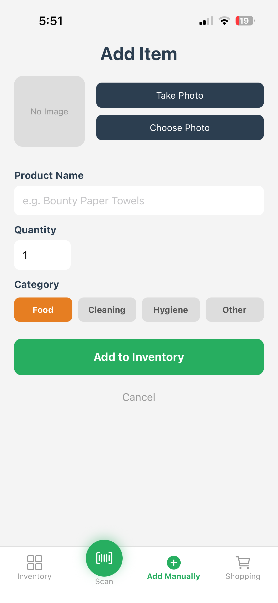
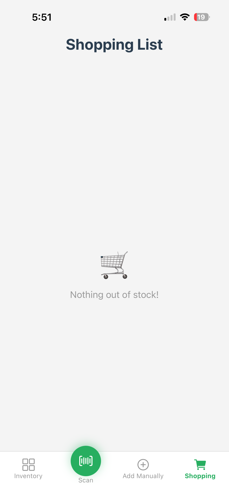

# Home Inventory App

A full-stack mobile app built with React Native (Expo) that helps households track their home inventory in real time.

## Features

- 📷 Barcode scanning using native iPhone/Android camera
- 🔍 Automatic product lookup via Open Food Facts and UPC Item DB APIs
- 🏠 Real-time shared inventory across all household devices (Supabase)
- 📦 Category organization (Food, Cleaning, Hygiene, Other)
- ⚠️ Low stock alerts via push notifications
- 🛒 Automatic shopping list for out of stock items
- 🔎 Search, filter by category, and sort inventory
- 📸 Product images auto-fetched or manually added
- 💾 Local barcode cache for products not found in databases

## Tech Stack

- React Native + Expo
- Supabase (PostgreSQL + Real-time)
- Expo Camera, Notifications, Image Picker
- AsyncStorage
- Open Food Facts API
- UPC Item DB API

## Screenshots

  
  
  
  

## Setup

1. Clone the repo
2. Run `npm install`
3. Create a `supabase.js` file with your own Supabase URL and anon key
4. Run `npx expo start`